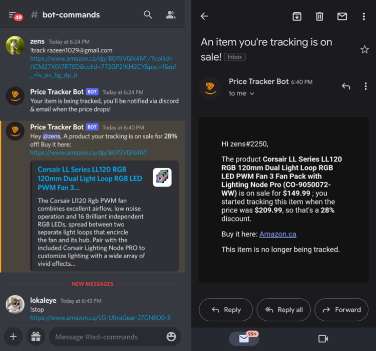

# Amazon Price Tracker Discord Bot 

A simple to use bot that allows for users to feed it an Amazon.ca link of a product they wish to track for a price drop. If the price of the item drops the user will be sent an email to notify them. Try it out yourself! 

## How it Works

When the **!track** command is used the bot obtains the users email address, ASIN and username. It then stores these values and the current product price into a document on MonogDB, if the ASIN already exists in the database the username and email will be appended to the coressponding documents username and email array so multiple users can be tracking the same product. 

The **!stop** command allows users to stop tracking a product, it requires the amazon link input so that the bot can query the database and find the product ASIN if it exists and remove the user from the mailing list if they were tracking it, if the mailing list is emtpy the document is deleted so that the product isn't being tracked for nobody. 

Every few minutes the program loops through the documents, obtains the ASIN values, scrapes the current prices on the Amazon site and compares it to the price written on file. If there is price drop an email is created using an HTML template and is then sent out using the Gmail API to all users that are tracking the product. The associated document is then deleted from the database.

This project utilizes Asynchronous Web Scraping, MonogDB, Gmail API and Discord API. 

## List of Commands
<pre><code>!commands 
!track <<e>email address> <<e>amazon link>
!stop <<e>amazon link>
</code></pre>

## Preview

  

